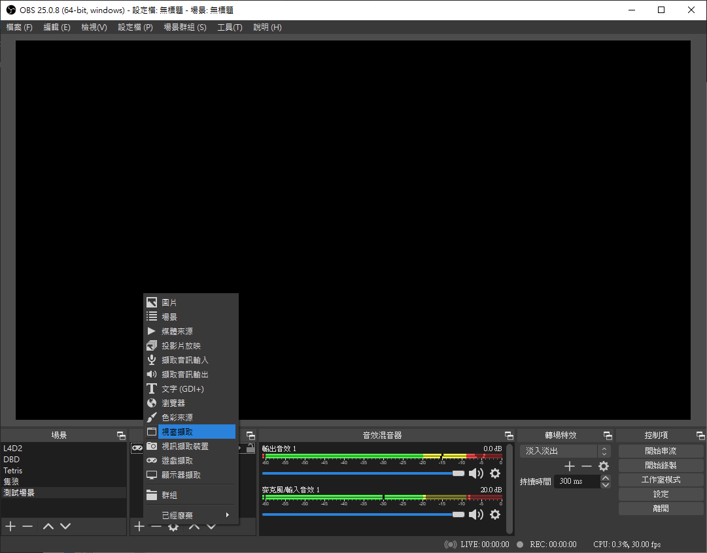
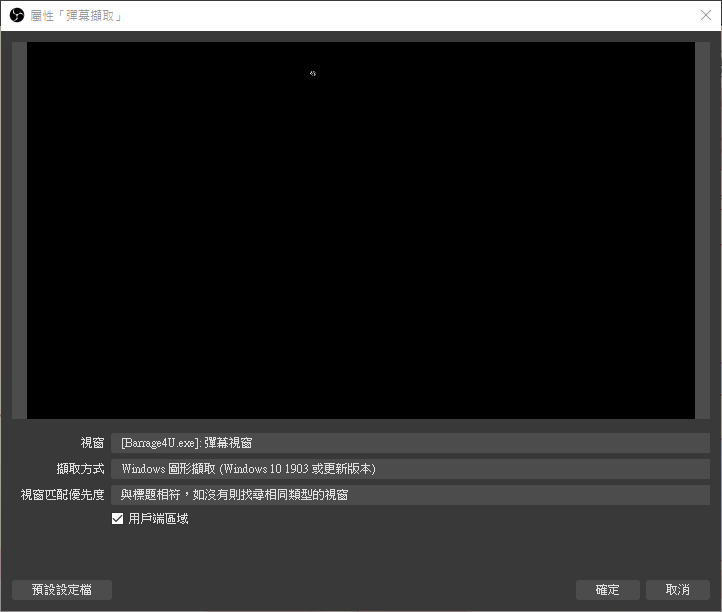
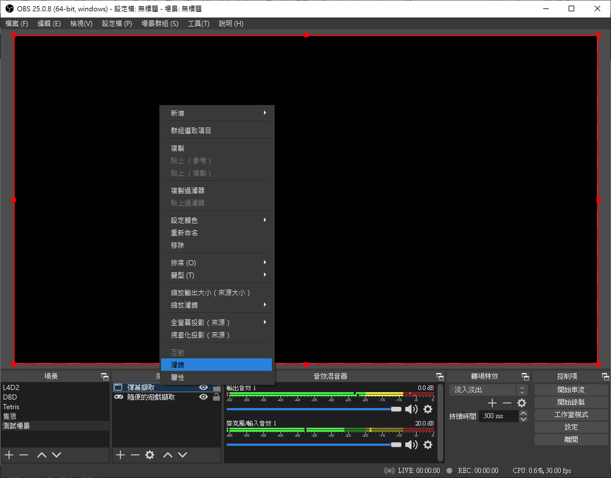
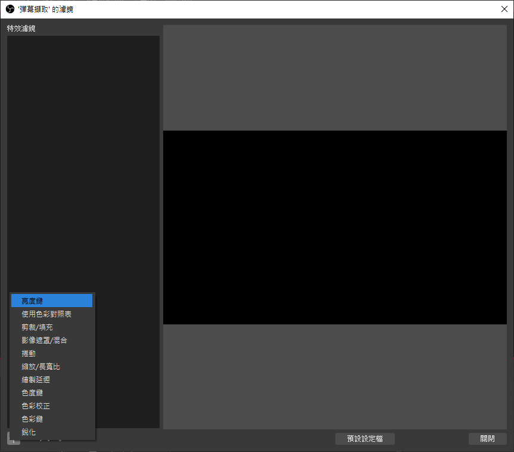

# 彈幕聊天室
這是一個給實況主使用的聊天室截取工具，不同於一般實況主使用的工具是一塊區域以滾動式顯示，此工具是將聊天室內容以彈幕方式發送在實況主的畫面上。

## 下載
[點此從專案中下載](https://github.com/shounen51/barrage4U/raw/main/exe/barrage4U.zip)

## 特色
- [x] 支援三大平台--discord, twitch, youtube
- [x] 支援twitch貼圖
- [x] 多種客製化設定
- [x] 不占用電腦資源
- [ ] 支援多種形式彈幕 (預計未來開發，歡迎提供創意彈幕形式)

## 展示
   

## 平台設定
### - Discord
透過以下網址可以將彈幕機器人加入discord伺服器(需要伺服器管理權限)
https://discord.com/api/oauth2/authorize?client_id=752913499637809233&permissions=0&scope=bot
在加入之後讓機器人有權限監聽想要發彈幕的文字頻道
啟動程式之後輸入discord伺服器以及該頻道之後即可

### - Twitch
在twitch平台上需要輸入的是實況主的ID而非使用名稱，ID會顯示在網址列，以木棉花官方頻道為例就是輸入muse_tw。

twitch上支援貼圖彈幕，如果頻道只有預設貼圖可以不做任何設定，如果是專屬貼圖則需要先到 [twitchemotes.com](https://twitchemotes.com/) 上拿到頻道ID，貼到twitch設定，**然後再進行連線**。

### - Youtube
在Youtube平台上需要輸入的是影片ID而非頻道ID，因為youtube直播會留存聊天室內容，如果有需要也可以使用聊天室重播來發射彈幕。

也**可以使用完整網址**來連線，但如果發現連線不上還請嘗試使用影片ID

## OBS截取設定
在OBS上除非使用全螢幕擷取否則有版本需求：
- windows 10 版本1903 以上
- OBS 25.0.8 以上

1. 新增視窗截取

2. 截取彈幕視窗，截取方式選擇 windows圖形截取

3. 對截取的彈幕視窗增加濾鏡

4. 選擇亮度鍵

## 詳細設定說明
### UI上進行設定
- 彈幕視窗至於頂部
	是否使彈幕強制顯示在畫面上，考慮到有的實況主有時可能自己不想看到彈幕，只想提供給觀眾看的時候可以將彈幕視窗收到下面 (預設開啟)

- 彈幕避開遊戲準心
	使遊戲準心的位置不會出現彈幕，避免遮蔽畫面正中央 (預設開啟)

- 顯示觀眾名稱
	在彈幕的前方加上觀眾名稱，觀眾名稱的顯示顏色為淡藍色 (預設開啟)

- 字體大小
	調整彈幕的字體大小，同時也會影響彈幕的位置，字體越小螢幕就可以容納更多彈幕 (調整完畢後需要重新開始程式，預設36)

- 顯示時間
	調整彈幕在螢幕上從出現到消失所需的秒數，影響彈幕行進速度 (調整完畢後需要重新開始程式，預設12)

- 字體透明
	調整彈幕的透明度，越往右越透明 (預設20)

### 調整setting.ini檔進行設定
- auto_connect
	開啟程式時會自動以上一次的設定自動連線，不推薦Youtube用戶開啟

- platform
	開啟程式時預設的連線平台 (上一次的連線平台)

- cover
	同 彈幕視窗至於頂部

- avoid_crosshair
	同 彈幕避開遊戲準心

- scrolling_text
	在螢幕最下方設置一個跑馬燈不斷的跑設定的文字，關閉時直接留空

- fps
	彈幕的刷新率，請配合實況設定，建議60不要調整

- size
	同 字體大小

- alive_time
	同 顯示時間

- amont_limit
	同時最大彈幕數量限制，給不想被大幅遮蔽畫面的人使用，預設200基本上等同於無上限

- long_limit
	彈幕長度限制，給不想被大幅遮蔽畫面的人使用，超過限制長度的留言將不被發送，預設30個字。(表情符號算一個字，會作用於跑馬燈)

- font
	彈幕使用的字體，**目前無法設定，固定為微軟正黑體**

- alpha
	同 字體透明

- name
	同 顯示觀眾名稱

- channel
	該平台上次的連線頻道

- emote
	是否開啟貼圖彈幕

## 注意事項
- 遊戲**不能是全螢幕**模式

- 切換 **彈幕視窗至於頂部** 功能之後需要將OBS的視窗截取關閉顯示再打開才能正常作用

- 彈幕本身會接收滑鼠點擊事件，換句話說滑鼠剛好點在彈幕上時遊戲會接收不到，這是頗嚴重的問題，希望有熟悉pyqt的高手可以提供解決方法，感恩

- 調整.ini設定後如果出現錯誤格式使程式無法載入時，程式將會自動載入預設設定

- .ini只會在程式開啟時讀取，並在程式關閉時自動儲存，所以請勿在程式開啟狀態下調整.ini

- 如果出現問題需要回報時請不要馬上再次開啟程式，先至log資料夾中將log檔備份以便回報

- 此原始碼無法直接下載執行，因為並沒有提供twitch和discord的TOKEN

- 任何問題請直接於本專案中發issue

- 任何建議也請於本專案中發issue

## 感謝
本程式使用[twitchemotes.com](https://twitchemotes.com/)提供的第三方API，以此感謝。

感謝[孤楓](https://www.twitch.tv/solitarymaple_?ignore_query=true)幫忙測試程式和twitch平台

感謝使用的你
